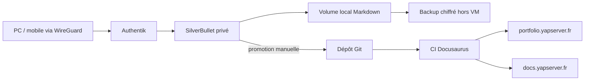

# Architecture du second brain et du site Docusaurus

## Décision

Le second brain utilisera **SilverBullet** comme espace privé de travail. Son
stockage en fichiers Markdown limite l'enfermement propriétaire, facilite les
sauvegardes et permet de promouvoir ensuite une note mûre vers Docusaurus.

Deux Docusaurus ont des finalités distinctes : `portfolio.yapserver.fr` raconte
le homelab et publie les cours cyber ; `docs.yapserver.fr` aide les utilisateurs
des services. Aucun des deux ne devient l'éditeur de notes quotidiennes.



## Implantation proposée

- VM cible : `cloud`, sauf si son niveau de charge impose une petite VM dédiée.
- URL privée : `secondbrain.yapserver.fr`, résolue uniquement sur le réseau interne.
- Entrée : Traefik, allowlist WireGuard et LAN d'administration.
- Authentification : forward-auth Authentik avec MFA ; authentification native
  SilverBullet conservée comme seconde barrière tant que son comportement avec
  le proxy n'a pas été validé.
- Conteneur : SilverBullet `2.7.0` épinglé, utilisateur non-root, filesystem
  racine en lecture seule si compatible après test.
- Données actives : disque local de VM, pas NFS, sous un volume `space`.
- Documents lourds : Nextcloud, référencés depuis les notes plutôt que copiés.
- Secrets : interdits ; une note contient au plus le nom de l'élément
  Vaultwarden et sa procédure d'usage.

## Taxonomie minimale

```text
Inbox/              capture rapide, à vider chaque semaine
Journal/            notes quotidiennes
Projects/           résultats bornés dans le temps
Areas/              responsabilités durables
Knowledge/          concepts et fiches de référence
Runbooks/           procédures opérables
Decisions/          ADR : contexte, décision, conséquences
Sources/            références et notes de lecture
Archive/            contenu inactif conservé
```

Chaque note porte si possible `type`, `status`, `created`, `updated`, `tags` et
`source`. Une note publiable passe de `seed` à `reviewed`, puis est réécrite dans
`portfolio/docs`; il n'y a pas de synchronisation automatique vers le public.

## Sauvegarde et reprise

Le dossier Markdown doit être sauvegardé quotidiennement vers un support hors
VM et hors stockage principal, avec une rétention 7/4/12. Un test mensuel doit
restaurer le dossier dans une instance éphémère et vérifier recherche, liens et
pièces jointes. Git peut fournir un historique supplémentaire, mais le dépôt du
second brain doit rester privé et ne remplace pas une sauvegarde.

## Phases

1. Sauvegarder les clés Age/backup dans Vaultwarden et hors ligne.
2. Déployer une instance vide sur `secondbrain.yapserver.fr`, VPN-only, puis
   tester Authentik et la restauration.
3. Importer un petit lot pilote et stabiliser taxonomie/templates pendant un mois.
4. Automatiser le backup et seulement ensuite importer le reste du savoir.
5. Construire un flux éditorial contrôlé vers Docusaurus.
