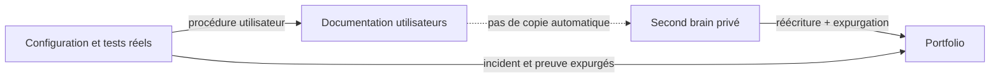

# Les trois surfaces de connaissance

## Responsabilités

| URL | Public | Public cible | Contenu | Source de vérité |
|---|---:|---|---|---|
| `portfolio.yapserver.fr` | À terme | recruteurs, pairs, apprenants | histoire du homelab, architecture expurgée, études de cas, cours cyber | Git, `portfolio/` |
| `docs.yapserver.fr` | VPN d'abord | utilisateurs des services | prise en main, paramètres, FAQ, dépannage | Git, futur `user-docs/` |
| `secondbrain.yapserver.fr` | non | propriétaire du homelab | notes, recherches, brouillons, décisions et savoir personnel | volume Markdown SilverBullet |

## Règles de circulation



- Aucun secret ne circule vers l'une de ces surfaces ; Vaultwarden reste la
  source de vérité des secrets.
- Une note SilverBullet n'est jamais publiée automatiquement.
- La documentation utilisateur ne révèle ni topologie interne ni procédure
  d'administration privilégiée.
- Le portfolio explique les décisions et apprentissages, sans devenir une copie
  de l'inventaire de production.

## Architecture de `docs.yapserver.fr`

Un second site Docusaurus indépendant est préférable à une section du
portfolio : navigation, cycle de mise à jour et public cible sont différents.

```text
user-docs/
├── docs/
│   ├── commencer/
│   ├── comptes-et-acces/
│   ├── services/
│   │   ├── jellyfin/
│   │   ├── navidrome/
│   │   ├── nextcloud/
│   │   ├── immich/
│   │   └── grafana/
│   ├── faq/
│   ├── depannage/
│   └── confidentialite-et-support/
├── static/
└── docusaurus.config.ts
```

Chaque service suit le même gabarit : objectif, accès, première connexion,
réglages recommandés, clients compatibles, questions fréquentes, dépannage et
méthode de demande d'aide. Les opérations réservées à l'administrateur restent
dans les runbooks internes.

## Architecture de `portfolio.yapserver.fr`

Le site existant conserve quatre axes : histoire du projet, construction de la
plateforme, études de cas et cours par spécialité cyber. Il sera exposé sur
Internet seulement après une revue d'expurgation, la mise en place du tunnel et
la validation des en-têtes, logs, limites de débit et sauvegardes.

## Convention de runbook

Toute session demandant plusieurs actions manuelles doit produire un runbook
numéroté avec : prérequis, commandes ou écrans, résultat attendu, validation et
retour arrière. Les actions de l'utilisateur et celles automatisées par le
control node doivent être clairement séparées.
